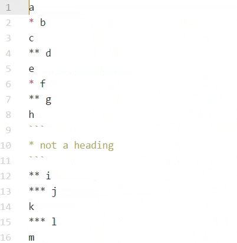

# orgfld

The source `mdfld` package implements folding in markdown files based on the heading character `#` (hash symbol).

This package reimplements the `mdfld` package using the asterisk `*` as the heading instead of the hash `#`.

Additionally, Windows friendly key mapping is added via CTRL-ALT-key combinations when the grammars `GitHub Markdown (gfm)` or `Org-mode Syntax (org-mode)` are in use by the file.

Windows Keymap:
```
orgfld:unfold-all                ctrl-alt-0
orgfld:fold-current-row          ctrl-alt-[
orgfld:fold-at-heading-level-1   ctrl-alt-1
orgfld:fold-at-heading-level-2   ctrl-alt-2
orgfld:fold-at-heading-level-3   ctrl-alt-3
orgfld:fold-at-heading-level-4   ctrl-alt-4
orgfld:fold-at-heading-level-5   ctrl-alt-5
orgfld:fold-at-heading-level-6   ctrl-alt-6

To unfold the current row, use the Atom built-in "editor:unfold-current-row" with default hotkey "ctrl-alt-]"

* Note: the Atom built-in "editor:fold-current-row" doesn't work for * folding.  If disabling "orgfld:fold-current-row", then the unfold won't work either.  Use orgfld:fold-current-row and Atom built-in "editor:unfold-current-row" to achieve expected results.
```

Demo:



## See also

* [mdfld](https://atom.io/packages/mfld) - Great implementation that is based on heading with "#" character
* [org-mode](https://atom.io/packages/org-mode) - Grammar for org-mode (.org) files
